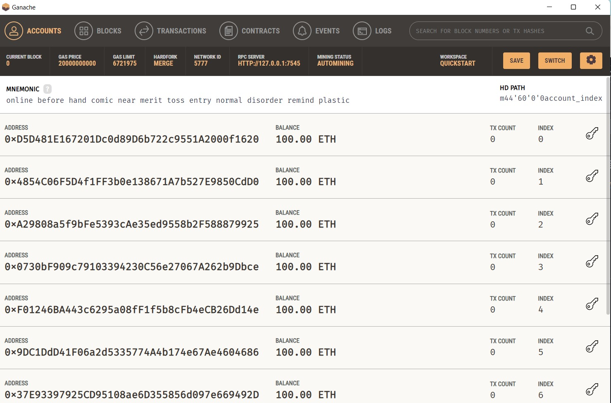
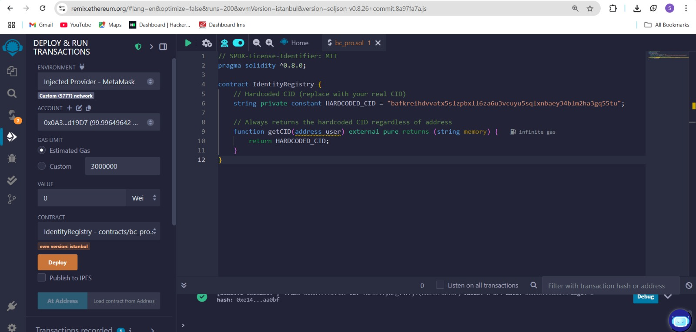
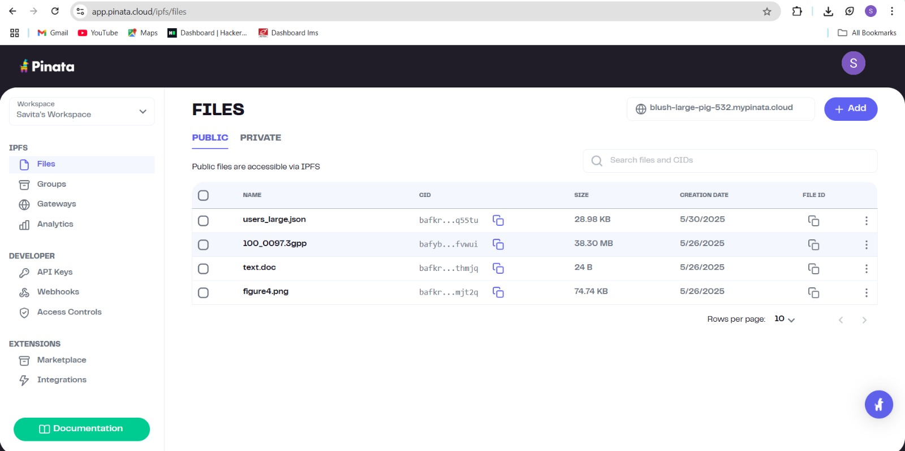
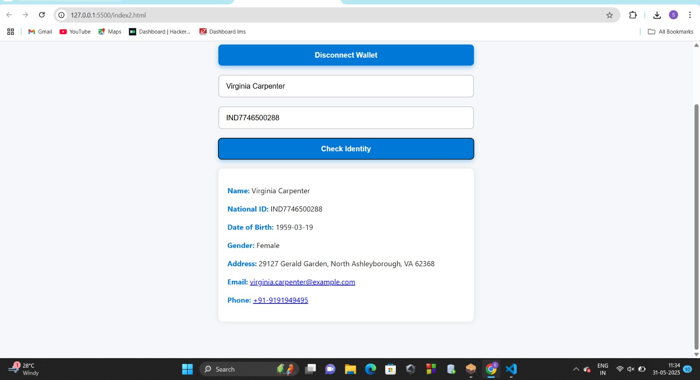

# 🔐 Digital Identity Verification on Blockchain

This project demonstrates a simple blockchain-based digital identity verification system using **Solidity**, **IPFS (Pinata)**, **MetaMask**, and a **frontend built with HTML + Ethers.js**.

---

## 📌 Features

- ✅ Self-Sovereign Identity using Ethereum
- 🔐 Secure document storage via IPFS (Pinata)
- ⚙️ Smart contract deployment and interaction using MetaMask and Remix IDE
- 🌐 Frontend with JavaScript and Ethers.js
- 🔗 Fully decentralized design: Ethereum + IPFS

---

## ⚙️ Prerequisites

Before running the project, ensure the following are installed:

- [MetaMask](https://metamask.io/) browser extension
  
- [Ganache](https://trufflesuite.com/ganache/) for local blockchain  
   

  
- [Remix IDE](https://remix.ethereum.org/)
    
  
- [Pinata IPFS Account](https://www.pinata.cloud/)
    
  
- [VS Code](https://code.visualstudio.com/) with Live Server extension (or any static file server)
 

---

## 🚀 Steps to Run the Project

### 1. Upload Identity Data to IPFS

- Log in to [Pinata](https://app.pinata.cloud/pinmanager)
- Upload the file: `users_large.json`
- Copy the **CID (Content Identifier)** shown after upload


### 2. Update Smart Contract

- Open `IdentityRegistry.sol` in [Remix IDE](https://remix.ethereum.org/)
- Replace the hardcoded CID in the contract:

  ```solidity
  string private constant HARDCODED_CID = "your_copied_cid_here";

### 3. Compile the Contract

- In Remix, go to the **Solidity Compiler** tab.
- Select **Compiler Version** `0.8.x`.
- Enable **Advanced Configurations**.
- Set **EVM Version** to `Istanbul`.
- Click **Compile** `IdentityRegistry.sol`.

### 4. Deploy the Contract

- Go to the **Deploy & Run Transactions** tab.
- Set **Environment** to `Injected Web3` (uses MetaMask).
- Select your desired **MetaMask account**.
- Click **Deploy**.
- Confirm the transaction in MetaMask.

### 5. Copy Deployed Contract Address

- After deployment, **copy the contract address** shown in Remix.

### 6. Update Frontend

- Open `index2.html` in a text/code editor.

- Locate the following line:

  ```javascript
  const contractAddress = "your_contract_address_here";


